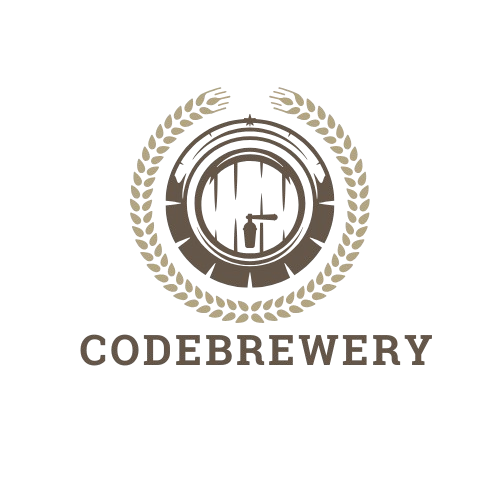

  
# CodeBrewery

CodeBrewery is an innovative web application that enables users to write, run, and experiment with code in multiple programming languages. Built with React for the frontend and Go for the backend, CodeBrewery provides an interactive platform for developers to learn and improve their coding skills through hands-on practice.

## Table of Contents

- [Features](#features)
- [Technologies](#technologies)
- [Architecture](#architecture)
- [Getting Started](#getting-started)
- [Running Tests](#running-tests)
- [Deployment](#deployment)
  - [Docker](#docker)
  - [Docker Compose](#docker-compose)
  - [Kubernetes](#kubernetes)
  - [Live Demo](#live-demo)
- [License](#license)
- [Acknowledgments](#acknowledgments)

## Features

- **Multi-language support**: Write and run code in C++, Java, Go, and Python.
- **Interactive code editor**: A user-friendly interface for editing and testing code snippets.
- **Real-time output**: See your code's output instantly.
- **Responsive design**: Optimized for both desktop and mobile devices.

## Technologies

<p align="left">
    
</p>

## Architecture

CodeBrewery is designed using a microservices architecture that currently consists of:

- **API Gateway**: Acts as the entry point for client requests, routing them to the appropriate services.
- **Code Execution Service**: Handles the execution of code snippets in multiple programming languages.

## Getting Started

To get a local copy of CodeBrewery up and running, follow these simple steps:

1. **Clone the repository**:

   ```bash
   git clone https://github.com/slashexx/CodeBrewery.git
   ```
2. **Navigate to the project directory**:

   ```bash
   cd CodeBrewery
   ```
3. **Install dependencies for each service** (optional):

   If you prefer to run the services separately, navigate into each service's folder and run:

- Backend :
   ```bash
   cd backend/api-gateway
   go mod download
   cd ../code-execution-service
   go mod download
   ```

- Frontend :
  ```bash
   cd frontend
   pnpm install
  ```

## Deployment

### Docker

CodeBrewery can be easily deployed using Docker. Here’s how:

1. **Build the Docker images**:

   From the root level of your project, run:

- Backend :
  ```bash
  cd backend/api-gateway
  docker build -t codebrewery-api-gateway .
  cd ../code-execution-service
  docker build -t codebrewery-code-execution-service .
  ```
- Frontend :
  ```bash
  cd ../../frontend
  docker build -t codebrewery-frontend .
  ```
  Then run each image separately !
  
### Docker Compose

For quick and easy setup of the entire project, you can use the `docker-compose.yml` file located at the root of the project. This setup will orchestrate all necessary services for both the API gateway and the code execution service.

1. **Make sure you have Docker and Docker Compose installed**.

2. **Start the application using Docker Compose**:

   ```bash
   docker-compose up --build
   ```

   This command will build and run all services defined in the `docker-compose.yml` file. Access the application at `http://localhost:5173`.

3. **Stop the application**:

   To stop all services, you can use:

   ```bash
   docker-compose down
   ```

### Kubernetes

For deploying CodeBrewery to a local Kubernetes cluster using Minikube, follow these steps:

1. **Prerequisites**: Ensure you have Minikube and kubectl installed and configured to use the Docker driver.

2. **Start Minikube**:

   ```bash
   minikube start --driver=docker
   ```

3. **Build Docker images**:

   Navigate to each backend directory and build the Docker images for the services:

   ```bash
   cd api-gateway
   docker build -t codebrewery-api-gateway:latest .
   cd ../code-execution-service
   docker build -t codebrewery-code-execution-service:latest .
   cd ../frontend
   docker build -t codebrewery-frontend:latest .
   ```

4. **Load Kubernetes YAML files**:

   Load the necessary Kubernetes configurations defined in the `k8s` directory. Run the following commands:

   ```bash
   kubectl apply -f k8s/api-gateway/
   kubectl apply -f k8s/code-execution-service/
   kubectl apply -f k8s/frontend/
   ```

5. **Check the status of the pods**:

   To see the running pods and ensure everything is functioning correctly, use:

   ```bash
   kubectl get pods
   ```

6. **Access the application**:

   You can access the frontend application using:

   ```bash
   minikube service codebrewery-frontend
   ```

   This command will open the default web browser to the service's URL.

### Live Demo

- The frontend of CodeBrewery is deployed on [Vercel](https://codebrewery.vercel.app).
- The backend microservices (API Gateway and Code Execution Service) are deployed as separate Docker images on Render, so the code _might_ take a while to execute on the first try since the server spins down on inactivity haha. It'll work fine after that though.

## Running Tests

To ensure everything is working as expected, you can run the tests using the following command from the frontend directory:

```bash
npm test
```

For backend tests, navigate to the respective service directory and run the tests using:

```bash
go test ./...
```

## GitHub Actions

This project uses GitHub Actions for Continuous Integration (CI). Every push and pull request to the `main` branch triggers automated tests to maintain code quality.

## License

Distributed under the MIT License. See `LICENSE` for more information.

## Acknowledgments

- [React](https://reactjs.org/)
- [Go](https://golang.org/)
- [Vite](https://vitejs.dev/)
- [Docker](https://www.docker.com/)
- [Kubernetes](https://kubernetes.io/)
- [GitHub Actions](https://github.com/features/actions)

---

Thank you for checking out CodeBrewery! Happy coding!

